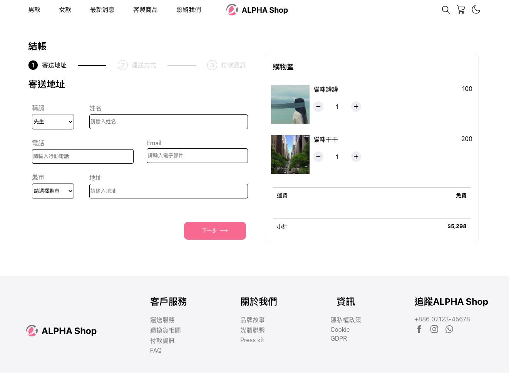

# ALPHA Shop
這是一個使用 React 打造的購物結帳頁面

# 功能
使用者可以依照步驟填寫表單，完成購物
# 開始使用
1. 請先確認是否有安裝 Node.js 和 npm
2. 將此專案 clone 到本地
3. 終端機進入專案資料夾輸入：
```
npm install
```
4. 安裝完畢後，執行專案輸入：
```
npm start
```
5. 專案執行後在瀏覽器輸入： http://localhost:3000
6. 若要停止專案，在終端機輸入 ctrl + c
# 使用工具
- Node.js v14.16
- React @18.2.0
- Sass
